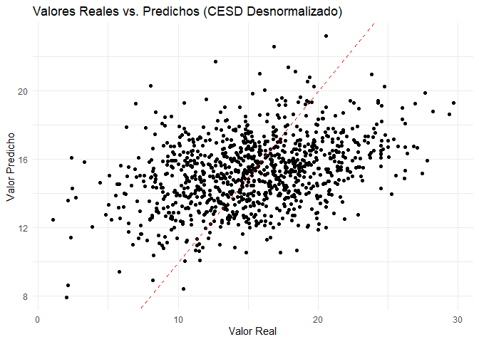
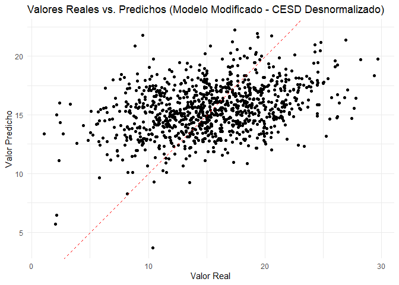
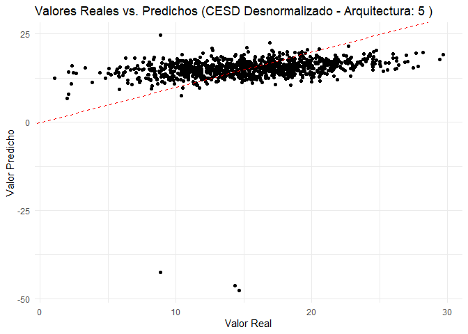
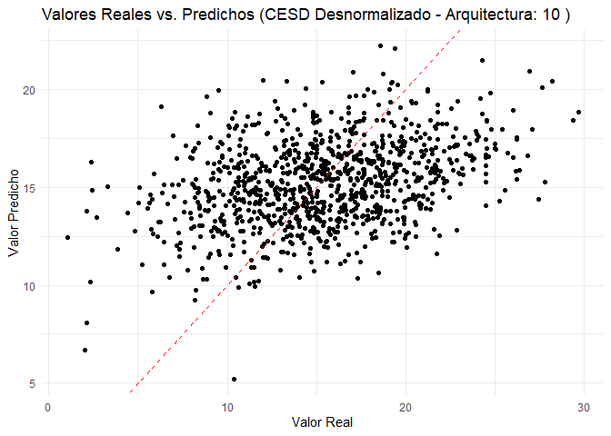
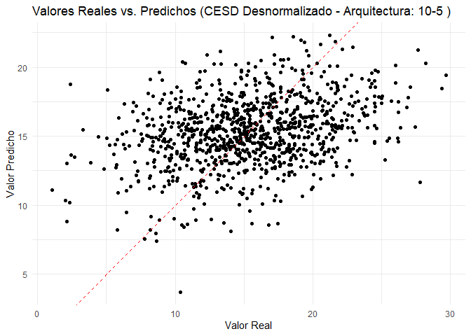
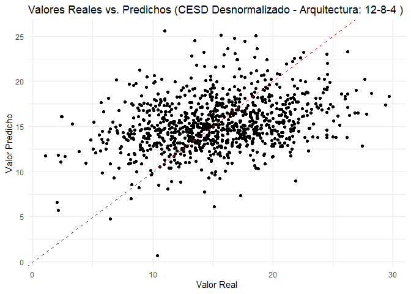

Estudio Modelo Redes Neuronales
================
Juan Moscardó Durá, Pablo Clemente, Christian Dujak, John Cabrera
2024-12-29

TFM Proyecto de viabilidad de un modelo predictivo de la escala de
depresión CES-D en base al tipo de contenido visualizado en las redes
sociales

Los integrantes del grupo somos:

- Pablo Clemente
- Juan Moscardo
- Christian Dujak
- John Fredy Cabrera Arciniegas

## Requerimientos

- RStudio
- R version 4.3.3 o superior

## Ejecutar

- recomendado ejecutar fichero Rmd con RStudio.

``` r
# Cargar paquetes
library(neuralnet)
library(caret)
```

    ## Loading required package: ggplot2

    ## Loading required package: lattice

``` r
library(dplyr)
```

    ## 
    ## Attaching package: 'dplyr'

    ## The following object is masked from 'package:neuralnet':
    ## 
    ##     compute

    ## The following objects are masked from 'package:stats':
    ## 
    ##     filter, lag

    ## The following objects are masked from 'package:base':
    ## 
    ##     intersect, setdiff, setequal, union

``` r
library(ggplot2)
```

``` r
# setwd("C:/Users/jmosc/OneDrive/Documents")
# Leer el archivo CSV
datos <- read.csv("datos_sinteticos.csv")

# Añadir la columna 'numerousuario'
datos <- datos %>% mutate(numerousuario = row_number())

# Reorganizar las columnas para que 'numerousuario' esté primero
datos <- datos %>% select(numerousuario, everything())

# Normalizar los datos para que estén entre 0 y 1 (importante para redes neuronales)
# Excepto 'numerousuario' y 'CESD' que los dejaremos como están de momento
normalize <- function(x) {
  return ((x - min(x)) / (max(x) - min(x)))
}

datos_norm <- datos %>%
  mutate_at(vars(-numerousuario, -CESD), normalize)

# Normalizar CESD entre 0 y 1 (aunque después se puede desnormalizar para interpretar)
datos_norm <- datos_norm %>%
  mutate(CESD = normalize(CESD))

# Explorar los datos
head(datos_norm)
```

    ##   numerousuario    Fitness      Moda     Viajes    Cocina   Belleza DecoracionHogar Tecnologia   Familia
    ## 1             1 0.67846570 0.2916870 0.58406647 0.7516336 0.4430630      0.54469385  0.6036798 0.4892971
    ## 2             2 0.07066561 0.5406897 0.52749965 0.5065344 0.6611685      0.82096773  0.5980902 0.5223057
    ## 3             3 0.45438951 0.3854517 0.39924839 0.4904751 0.6453933      0.52919372  0.6046373 0.4223024
    ## 4             4 0.47290437 0.3385115 0.05413399 0.6625000 0.6033692      0.42401339  0.4339328 0.5226538
    ## 5             5 0.61816436 0.6687448 0.85468330 0.4181253 0.4878773      0.34069017  0.4211662 0.1830218
    ## 6             6 0.40607689 0.5489244 0.12222829 0.6106874 0.5725736      0.09541947  0.4326993 0.2952087
    ##          Arte Motivacion      CESD
    ## 1 0.526730590  0.5840210 0.5311103
    ## 2 0.009424107  0.1694912 0.5378152
    ## 3 0.182075271  0.3988960 0.6538037
    ## 4 0.667126196  0.4230216 0.5212715
    ## 5 0.521287788  0.5762057 0.7659198
    ## 6 0.497489159  0.5458151 0.4552981

``` r
summary(datos_norm)
```

    ##  numerousuario     Fitness            Moda            Viajes           Cocina          Belleza      
    ##  Min.   :   1   Min.   :0.0000   Min.   :0.0000   Min.   :0.0000   Min.   :0.0000   Min.   :0.0000  
    ##  1st Qu.:1251   1st Qu.:0.3607   1st Qu.:0.3962   1st Qu.:0.2571   1st Qu.:0.4318   1st Qu.:0.3831  
    ##  Median :2500   Median :0.4557   Median :0.4972   Median :0.5124   Median :0.5254   Median :0.4759  
    ##  Mean   :2500   Mean   :0.4574   Mean   :0.4951   Mean   :0.5077   Mean   :0.5243   Mean   :0.4750  
    ##  3rd Qu.:3750   3rd Qu.:0.5538   3rd Qu.:0.5938   3rd Qu.:0.7562   3rd Qu.:0.6182   3rd Qu.:0.5661  
    ##  Max.   :5000   Max.   :1.0000   Max.   :1.0000   Max.   :1.0000   Max.   :1.0000   Max.   :1.0000  
    ##  DecoracionHogar    Tecnologia        Familia            Arte          Motivacion          CESD       
    ##  Min.   :0.0000   Min.   :0.0000   Min.   :0.0000   Min.   :0.0000   Min.   :0.0000   Min.   :0.0000  
    ##  1st Qu.:0.2423   1st Qu.:0.3635   1st Qu.:0.3835   1st Qu.:0.2515   1st Qu.:0.3805   1st Qu.:0.5000  
    ##  Median :0.4880   Median :0.4444   Median :0.4851   Median :0.5091   Median :0.4718   Median :0.5857  
    ##  Mean   :0.4941   Mean   :0.4424   Mean   :0.4843   Mean   :0.5042   Mean   :0.4736   Mean   :0.5848  
    ##  3rd Qu.:0.7416   3rd Qu.:0.5215   3rd Qu.:0.5838   3rd Qu.:0.7541   3rd Qu.:0.5703   3rd Qu.:0.6697  
    ##  Max.   :1.0000   Max.   :1.0000   Max.   :1.0000   Max.   :1.0000   Max.   :1.0000   Max.   :1.0000

``` r
# Dividir los datos en entrenamiento y prueba (80% entrenamiento, 20% prueba)
set.seed(123) # Para reproducibilidad
indices <- createDataPartition(datos_norm$CESD, p = 0.8, list = FALSE)
entrenamiento <- datos_norm[indices, ]
prueba <- datos_norm[-indices, ]

# Definir la fórmula del modelo
# Predecir CESD en función de todas las otras variables
formula_nn <- CESD ~ Fitness + Moda + Viajes + Cocina + Belleza + DecoracionHogar + Tecnologia + Familia + Arte + Motivacion

# Entrenar la red neuronal
# Vamos a usar una arquitectura simple con una capa oculta de 5 neuronas
# Puedes ajustar 'hidden' para experimentar con diferentes arquitecturas
# linear.output = FALSE lo usaremos para que la última capa de la red neuronal tenga la función sigmoide, de forma que los datos de salida estén comprendidos entre 0 y 1, como los de entrada,
# si queremos que no sea así y poder obtener datos de salida por encima de 1 o por debajo de 0 (como en este caso), debemos de usar el argumento linear.output=TRUE.
# Vamos a usar este argumento para tener mayor flexibilidad en la predicción de salida y compararlo con los datos desnormalizados de CES-D
modelo_nn <- neuralnet(formula_nn, data = entrenamiento, hidden = c(5), linear.output = TRUE, stepmax=1e6)

# Visualizar la red neuronal 
plot(modelo_nn)
```

``` r
# Hacer predicciones sobre el conjunto de prueba
# Usamos predict en lugar de compute
predicciones <- predict(modelo_nn, prueba[, -which(names(prueba) %in% c("numerousuario", "CESD"))])

# Extraer los valores predichos (ya es una matriz, no una lista)
predicciones_valor <- predicciones

# Desnormalizar las predicciones y los valores reales de CESD para interpretar los resultados
# Obtenemos los valores mínimo y máximo de la variable CESD sin normalizar
min_CESD <- min(datos$CESD)
max_CESD <- max(datos$CESD)
# Desnormalizamos los valores predichos
predicciones_desnormalizadas <- predicciones_valor * (max_CESD - min_CESD) + min_CESD
# Desnormalizamos los valores reales
prueba_desnormalizada <- prueba$CESD * (max_CESD - min_CESD) + min_CESD

# Calcular el error cuadrático medio (RMSE)
rmse <- sqrt(mean((prueba_desnormalizada - predicciones_desnormalizadas)^2))
print(paste("RMSE:", rmse))
```

    ## [1] "RMSE: 4.45792436284198"

``` r
# Calcular el R cuadrado
r2 <- 1 - (sum((prueba_desnormalizada - predicciones_desnormalizadas)^2) / sum((prueba_desnormalizada - mean(prueba_desnormalizada))^2))
print(paste("R-cuadrado:", r2))
```

    ## [1] "R-cuadrado: 0.133172377591158"

``` r
# Crear un dataframe para comparar valores reales y predichos desnormalizados
comparacion <- data.frame(Real = prueba_desnormalizada, Predicho = predicciones_desnormalizadas)

# Gráfico de dispersión de valores reales vs predichos desnormalizados
ggplot(comparacion, aes(x = Real, y = Predicho)) +
  geom_point() +
  geom_abline(intercept = 0, slope = 1, linetype = "dashed", color = "red") +
  labs(title = "Valores Reales vs. Predichos (CESD Desnormalizado)",
       x = "Valor Real",
       y = "Valor Predicho") +
  theme_minimal()
```

<!-- -->

``` r
# 5. Intentando forzar mayor correlación entre Belleza, Moda y CES-D (Opcional y Experimental):

# Identificar los registros donde Belleza y Moda son altos
registros_belleza_moda_altos <- entrenamiento %>%
  filter(Belleza > 0.6 & Moda > 0.6) # Ajusta el umbral según tus datos

# Para esos registros, aumentar artificialmente el valor de CESD (experimental)
registros_belleza_moda_altos_modificados <- registros_belleza_moda_altos %>%
  mutate(CESD = ifelse(CESD < 0.8, CESD + 0.1, 1)) # Aumenta CESD en 0.1, máximo 1

# Combinar los datos modificados con el conjunto de entrenamiento original
entrenamiento_modificado <- rbind(entrenamiento, registros_belleza_moda_altos_modificados)

# Entrenar un nuevo modelo con los datos modificados
modelo_nn_modificado <- neuralnet(formula_nn, data = entrenamiento_modificado, hidden = 5, linear.output = TRUE, stepmax=1e6)

# Evaluar el nuevo modelo modificado:

# Hacer predicciones sobre el conjunto de prueba con el modelo modificado
predicciones_mod <- predict(modelo_nn_modificado, prueba[, -which(names(prueba) %in% c("numerousuario", "CESD"))])

# Extraer los valores predichos
predicciones_valor_mod <- predicciones_mod

# Desnormalizar las predicciones del modelo modificado
predicciones_desnormalizadas_mod <- predicciones_valor_mod * (max_CESD - min_CESD) + min_CESD

# Calcular el error cuadrático medio (RMSE) del modelo modificado
rmse_mod <- sqrt(mean((prueba_desnormalizada - predicciones_desnormalizadas_mod)^2))
print(paste("RMSE (Modelo Modificado):", rmse_mod))
```

    ## [1] "RMSE (Modelo Modificado): 4.48805386596454"

``` r
# Calcular el R cuadrado del modelo modificado
r2_mod <- 1 - (sum((prueba_desnormalizada - predicciones_desnormalizadas_mod)^2) / sum((prueba_desnormalizada - mean(prueba_desnormalizada))^2))
print(paste("R-cuadrado (Modelo Modificado):", r2_mod))
```

    ## [1] "R-cuadrado (Modelo Modificado): 0.121415630995861"

``` r
# Crear un dataframe para comparar valores reales y predichos del modelo modificado
comparacion_mod <- data.frame(Real = prueba_desnormalizada, Predicho = predicciones_desnormalizadas_mod)

# Gráfico de dispersión de valores reales vs predichos del modelo modificado
ggplot(comparacion_mod, aes(x = Real, y = Predicho)) +
  geom_point() +
  geom_abline(intercept = 0, slope = 1, linetype = "dashed", color = "red") +
  labs(title = "Valores Reales vs. Predichos (Modelo Modificado - CESD Desnormalizado)",
       x = "Valor Real",
       y = "Valor Predicho") +
  theme_minimal()
```

<!-- -->

``` r
# Comparar RMSE y R-cuadrado de ambos modelos
print(paste("RMSE (Modelo Original):", rmse))
```

    ## [1] "RMSE (Modelo Original): 4.45792436284198"

``` r
print(paste("RMSE (Modelo Modificado):", rmse_mod))
```

    ## [1] "RMSE (Modelo Modificado): 4.48805386596454"

``` r
print(paste("R-cuadrado (Modelo Original):", r2))
```

    ## [1] "R-cuadrado (Modelo Original): 0.133172377591158"

``` r
print(paste("R-cuadrado (Modelo Modificado):", r2_mod))
```

    ## [1] "R-cuadrado (Modelo Modificado): 0.121415630995861"

``` r
# (Opcional) Visualizar la correlación entre Belleza, Moda y CES-D en el conjunto de prueba
cor_prueba <- cor(prueba[, c("Belleza", "Moda", "CESD")])
print("Correlación en el conjunto de prueba (Original):")
```

    ## [1] "Correlación en el conjunto de prueba (Original):"

``` r
print(cor_prueba)
```

    ##             Belleza       Moda        CESD
    ## Belleza 1.000000000 0.69822135 0.007219476
    ## Moda    0.698221351 1.00000000 0.028983607
    ## CESD    0.007219476 0.02898361 1.000000000

``` r
# Como no podemos cambiar la correlación de los datos de prueba, esta correlación no va a cambiar
# Podemos obtener como se relacionan las variables del modelo modificado a partir de las predicciones:
# Calcular la correlación en las predicciones del modelo modificado
cor_predicciones_mod <- cor(data.frame(Belleza = prueba$Belleza, Moda = prueba$Moda, CESD = predicciones_desnormalizadas_mod))
print("Correlación en las predicciones del modelo modificado:")
```

    ## [1] "Correlación en las predicciones del modelo modificado:"

``` r
print(cor_predicciones_mod)
```

    ##           Belleza      Moda      CESD
    ## Belleza 1.0000000 0.6982214 0.1503727
    ## Moda    0.6982214 1.0000000 0.1881123
    ## CESD    0.1503727 0.1881123 1.0000000

``` r
# --- Carga de Paquetes ---
library(neuralnet)
library(caret)
library(dplyr)
library(ggplot2)

# --- Carga y Preprocesamiento de Datos ---
#setwd("C:/Users/jmosc/Downloads") # ¡AJUSTA A TU RUTA!
datos <- read.csv("datos_sinteticos.csv")
datos <- datos %>% mutate(numerousuario = row_number())
datos <- datos %>% select(numerousuario, everything())

# --- Normalización CORRECTA ---
min_max_values <- datos %>%
  select(-numerousuario, -CESD) %>%
  summarise_all(list(min = min, max = max))

min_CESD <- min(datos$CESD)
max_CESD <- max(datos$CESD)

normalize <- function(x, min_val, max_val) {
  return ((x - min_val) / (max_val - min_val))
}

datos_norm <- datos %>%
  mutate(across(c(-numerousuario, -CESD), ~ normalize(., min_max_values[[paste0(cur_column(), "_min")]], min_max_values[[paste0(cur_column(), "_max")]]))) %>%
  mutate(CESD = normalize(CESD, min_CESD, max_CESD))

# --- División de Datos ---
set.seed(123)
indices <- createDataPartition(datos_norm$CESD, p = 0.8, list = FALSE)
entrenamiento <- datos_norm[indices, ]
prueba <- datos_norm[-indices, ]

# --- Modelado con Redes Neuronales ---
formula_nn <- CESD ~ Fitness + Moda + Viajes + Cocina + Belleza + DecoracionHogar + Tecnologia + Familia + Arte + Motivacion

# Lista de arquitecturas a probar (incluyendo la de 5 neuronas para la comparación)
arquitecturas <- list(c(5), c(10), c(10, 5), c(12, 8, 4))
resultados <- data.frame()
```

este posible for puede ejecutar las opciones de arquitectura pero para
no perder el estado de procesamiento en cada modelo, se separan en
bloques el mismo codigo y poder observar el avance:

``` r
#for (arquitectura in arquitecturas) {
#  set.seed(456) # Semilla para cada arquitectura
#  modelo_nn <- neuralnet(formula_nn, data = entrenamiento, hidden = arquitectura, linear.output = TRUE, stepmax=1e6)
#  
#  predicciones <- predict(modelo_nn, prueba[, -which(names(prueba) %in% c("numerousuario", "CESD"))])
#  predicciones_desnormalizadas <- predicciones * (max_CESD - min_CESD) + min_CESD
#  prueba_desnormalizada <- (prueba$CESD * (max_CESD - min_CESD)) + min_CESD
#  
#  rmse <- sqrt(mean((prueba_desnormalizada - predicciones_desnormalizadas)^2))
#  r2 <- 1 - (sum((prueba_desnormalizada - predicciones_desnormalizadas)^2) / sum((prueba_desnormalizada - mean(prueba_desnormalizada))^2))
#  
#  resultados <- rbind(resultados, data.frame(Arquitectura = paste(arquitectura, collapse = "-"), RMSE = rmse, R2 = r2))
#
#  # Gráfico de dispersión (opcional)
#    comparacion <- data.frame(Real = prueba_desnormalizada, Predicho = predicciones_desnormalizadas)
#    print(ggplot(comparacion, aes(x = Real, y = Predicho)) +
#      geom_point() +
#      geom_abline(intercept = 0, slope = 1, linetype = "dashed", color = "red") +
#      labs(title = paste("Valores Reales vs. Predichos (CESD Desnormalizado - Arquitectura:", paste(arquitectura, collapse = "-"), ")"),
#           x = "Valor Real",
#           y = "Valor Predicho") +
#      theme_minimal())
#}
```

## arquitectura 1 capa oculta de 5 neuronas

``` r
arquitectura = c(5)
set.seed(456) # Semilla para cada arquitectura
modelo_nn <- neuralnet(formula_nn, data = entrenamiento, hidden = arquitectura, linear.output = TRUE, stepmax=1e6)

predicciones <- predict(modelo_nn, prueba[, -which(names(prueba) %in% c("numerousuario", "CESD"))])
predicciones_desnormalizadas <- predicciones * (max_CESD - min_CESD) + min_CESD
prueba_desnormalizada <- (prueba$CESD * (max_CESD - min_CESD)) + min_CESD

rmse <- sqrt(mean((prueba_desnormalizada - predicciones_desnormalizadas)^2))
r2 <- 1 - (sum((prueba_desnormalizada - predicciones_desnormalizadas)^2) / sum((prueba_desnormalizada - mean(prueba_desnormalizada))^2))

resultados <- rbind(resultados, data.frame(Arquitectura = paste(arquitectura, collapse = "-"), RMSE = rmse, R2 = r2))

# Gráfico de dispersión (opcional)
comparacion <- data.frame(Real = prueba_desnormalizada, Predicho = predicciones_desnormalizadas)
print(ggplot(comparacion, aes(x = Real, y = Predicho)) +
geom_point() +
geom_abline(intercept = 0, slope = 1, linetype = "dashed", color = "red") +
labs(title = paste("Valores Reales vs. Predichos (CESD Desnormalizado - Arquitectura:", paste(arquitectura, collapse = "-"), ")"),
     x = "Valor Real",
     y = "Valor Predicho") +
theme_minimal())
```

<!-- -->

## arquitectura 1 capa oculta de 10 neuronas

``` r
arquitectura = c(10)
set.seed(456) # Semilla para cada arquitectura
modelo_nn <- neuralnet(formula_nn, data = entrenamiento, hidden = arquitectura, linear.output = TRUE, stepmax=1e6)

predicciones <- predict(modelo_nn, prueba[, -which(names(prueba) %in% c("numerousuario", "CESD"))])
predicciones_desnormalizadas <- predicciones * (max_CESD - min_CESD) + min_CESD
prueba_desnormalizada <- (prueba$CESD * (max_CESD - min_CESD)) + min_CESD

rmse <- sqrt(mean((prueba_desnormalizada - predicciones_desnormalizadas)^2))
r2 <- 1 - (sum((prueba_desnormalizada - predicciones_desnormalizadas)^2) / sum((prueba_desnormalizada - mean(prueba_desnormalizada))^2))

resultados <- rbind(resultados, data.frame(Arquitectura = paste(arquitectura, collapse = "-"), RMSE = rmse, R2 = r2))

# Gráfico de dispersión (opcional)
comparacion <- data.frame(Real = prueba_desnormalizada, Predicho = predicciones_desnormalizadas)
print(ggplot(comparacion, aes(x = Real, y = Predicho)) +
geom_point() +
geom_abline(intercept = 0, slope = 1, linetype = "dashed", color = "red") +
labs(title = paste("Valores Reales vs. Predichos (CESD Desnormalizado - Arquitectura:", paste(arquitectura, collapse = "-"), ")"),
     x = "Valor Real",
     y = "Valor Predicho") +
theme_minimal())
```

<!-- -->

## arquitectura 2 capas ocultas de 10 y 5 neuronas

``` r
arquitectura = c(10, 5)
set.seed(456) # Semilla para cada arquitectura
modelo_nn <- neuralnet(formula_nn, data = entrenamiento, hidden = arquitectura, linear.output = TRUE, stepmax=1e6)

predicciones <- predict(modelo_nn, prueba[, -which(names(prueba) %in% c("numerousuario", "CESD"))])
predicciones_desnormalizadas <- predicciones * (max_CESD - min_CESD) + min_CESD
prueba_desnormalizada <- (prueba$CESD * (max_CESD - min_CESD)) + min_CESD

rmse <- sqrt(mean((prueba_desnormalizada - predicciones_desnormalizadas)^2))
r2 <- 1 - (sum((prueba_desnormalizada - predicciones_desnormalizadas)^2) / sum((prueba_desnormalizada - mean(prueba_desnormalizada))^2))

resultados <- rbind(resultados, data.frame(Arquitectura = paste(arquitectura, collapse = "-"), RMSE = rmse, R2 = r2))

# Gráfico de dispersión (opcional)
comparacion <- data.frame(Real = prueba_desnormalizada, Predicho = predicciones_desnormalizadas)
print(ggplot(comparacion, aes(x = Real, y = Predicho)) +
geom_point() +
geom_abline(intercept = 0, slope = 1, linetype = "dashed", color = "red") +
labs(title = paste("Valores Reales vs. Predichos (CESD Desnormalizado - Arquitectura:", paste(arquitectura, collapse = "-"), ")"),
     x = "Valor Real",
     y = "Valor Predicho") +
theme_minimal())
```

<!-- -->

## arquitectura 3 capas ocultas de 12, 8 y 4 neuronas

``` r
arquitectura = c(12, 8, 4)
set.seed(456) # Semilla para cada arquitectura
modelo_nn <- neuralnet(formula_nn, data = entrenamiento, hidden = arquitectura, linear.output = TRUE, stepmax=1e6)

predicciones <- predict(modelo_nn, prueba[, -which(names(prueba) %in% c("numerousuario", "CESD"))])
predicciones_desnormalizadas <- predicciones * (max_CESD - min_CESD) + min_CESD
prueba_desnormalizada <- (prueba$CESD * (max_CESD - min_CESD)) + min_CESD

rmse <- sqrt(mean((prueba_desnormalizada - predicciones_desnormalizadas)^2))
r2 <- 1 - (sum((prueba_desnormalizada - predicciones_desnormalizadas)^2) / sum((prueba_desnormalizada - mean(prueba_desnormalizada))^2))

resultados <- rbind(resultados, data.frame(Arquitectura = paste(arquitectura, collapse = "-"), RMSE = rmse, R2 = r2))

# Gráfico de dispersión (opcional)
comparacion <- data.frame(Real = prueba_desnormalizada, Predicho = predicciones_desnormalizadas)
print(ggplot(comparacion, aes(x = Real, y = Predicho)) +
geom_point() +
geom_abline(intercept = 0, slope = 1, linetype = "dashed", color = "red") +
labs(title = paste("Valores Reales vs. Predichos (CESD Desnormalizado - Arquitectura:", paste(arquitectura, collapse = "-"), ")"),
     x = "Valor Real",
     y = "Valor Predicho") +
theme_minimal())
```

<!-- -->
\## Comparación de Resultados

``` r
# --- Comparación de Resultados ---
print("Resultados de las diferentes arquitecturas:")
```

    ## [1] "Resultados de las diferentes arquitecturas:"

``` r
print(resultados)
```

    ##   Arquitectura     RMSE          R2
    ## 1            5 5.478967 -0.30937719
    ## 2           10 4.494128  0.11903568
    ## 3         10-5 4.627745  0.06587254
    ## 4       12-8-4 4.760864  0.01135828

``` r
# --- Seleccionar la mejor arquitectura ---
mejor_arquitectura <- resultados %>% arrange(RMSE) %>% slice(1)
print("Mejor Arquitectura según RMSE:")
```

    ## [1] "Mejor Arquitectura según RMSE:"

``` r
print(mejor_arquitectura)
```

    ##   Arquitectura     RMSE        R2
    ## 1           10 4.494128 0.1190357

``` r
# --- Entrenar el modelo final con la mejor arquitectura ---
set.seed(456) #Mantener la semilla para resultados consistentes
modelo_nn_final <- neuralnet(formula_nn, data = entrenamiento, hidden = as.numeric(strsplit(mejor_arquitectura$Arquitectura, "-")[[1]]), linear.output = TRUE, stepmax=1e6)

# --- Forzar Correlación (REVISAR ESTE ENFOQUE) ---
# ... (Código para modificar datos, pero con precaución y justificación teórica)

# --- Correlaciones ---
# ... (Código para calcular y mostrar correlaciones)

# --- Comparación con la Arquitectura de 5 Neuronas ---
resultados_5_neuronas <- resultados %>% filter(Arquitectura == "5")
print("Resultados con 5 neuronas:")
```

    ## [1] "Resultados con 5 neuronas:"

``` r
print(resultados_5_neuronas)
```

    ##   Arquitectura     RMSE         R2
    ## 1            5 5.478967 -0.3093772

``` r
# --- Comparación directa en la consola ---
cat("\nComparación directa:\n")
```

    ## 
    ## Comparación directa:

``` r
cat(paste("Arquitectura:", resultados$Arquitectura, "\n"))
```

    ## Arquitectura: 5 
    ##  Arquitectura: 10 
    ##  Arquitectura: 10-5 
    ##  Arquitectura: 12-8-4

``` r
cat(paste("RMSE:", resultados$RMSE, "\n"))
```

    ## RMSE: 5.47896732763413 
    ##  RMSE: 4.49412848942638 
    ##  RMSE: 4.62774471486538 
    ##  RMSE: 4.76086418094298

``` r
cat(paste("R2:", resultados$R2, "\n"))
```

    ## R2: -0.309377193750112 
    ##  R2: 0.119035676892118 
    ##  R2: 0.0658725421220501 
    ##  R2: 0.0113582765011859

``` r
cat("\nResultados con 5 neuronas:\n")
```

    ## 
    ## Resultados con 5 neuronas:

``` r
cat(paste("RMSE:", resultados_5_neuronas$RMSE, "\n"))
```

    ## RMSE: 5.47896732763413

``` r
cat(paste("R2:", resultados_5_neuronas$R2, "\n"))
```

    ## R2: -0.309377193750112

``` r
# --- Tabla comparativa (para el informe) ---
library(knitr) # Para formatear tablas en R Markdown

tabla_comparativa <- resultados %>%
  mutate(Arquitectura = ifelse(Arquitectura == "5", "5 Neuronas (Original)", Arquitectura)) %>% #Renombrar para mayor claridad
  kable(caption = "Comparación de Resultados entre Arquitecturas",
        col.names = c("Arquitectura", "RMSE", "R²"),
        digits = 4) # 4 decimales

print(tabla_comparativa)
```

    ## 
    ## 
    ## Table: Comparación de Resultados entre Arquitecturas
    ## 
    ## |Arquitectura          |   RMSE|      R²|
    ## |:---------------------|------:|-------:|
    ## |5 Neuronas (Original) | 5.4790| -0.3094|
    ## |10                    | 4.4941|  0.1190|
    ## |10-5                  | 4.6277|  0.0659|
    ## |12-8-4                | 4.7609|  0.0114|
